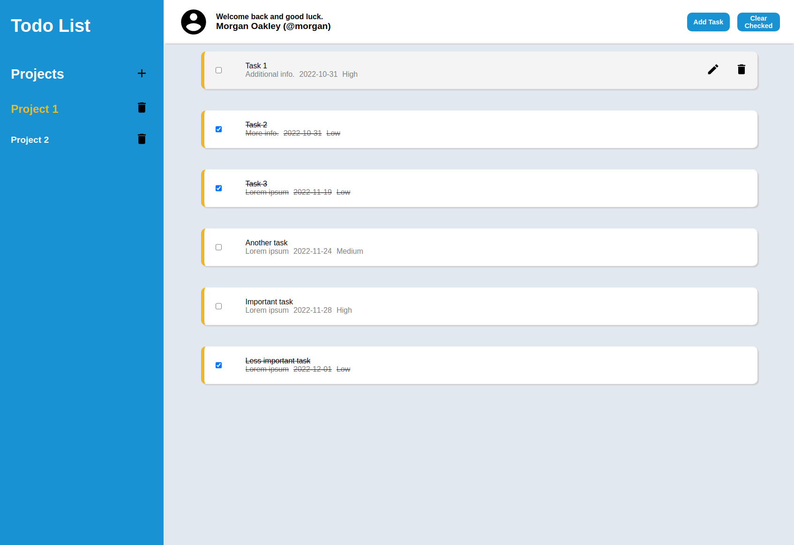
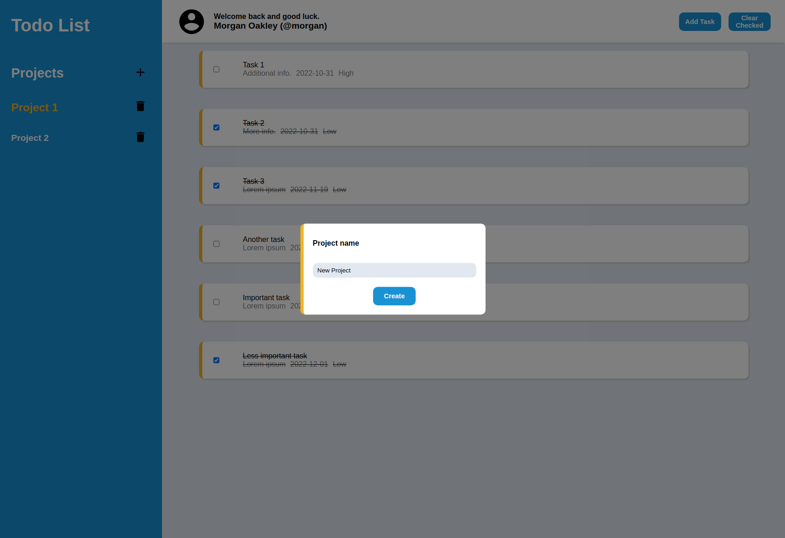
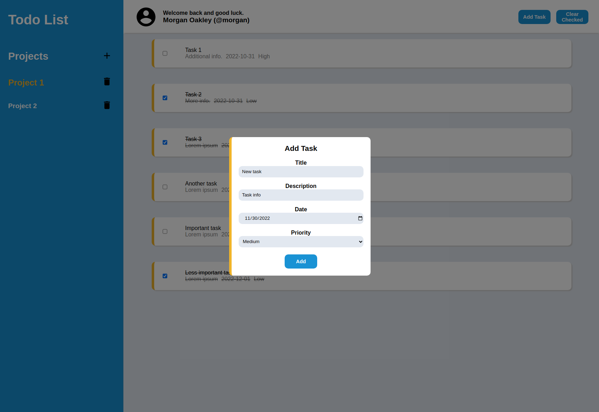
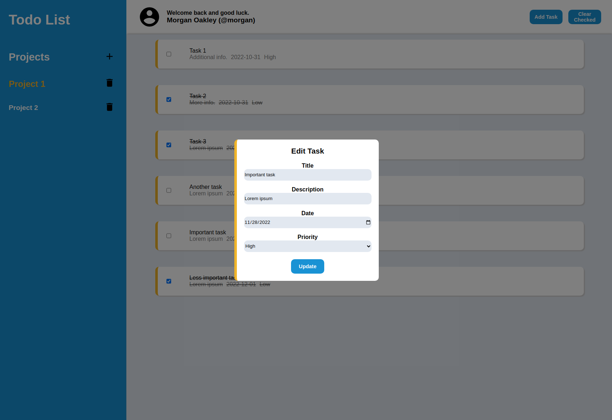
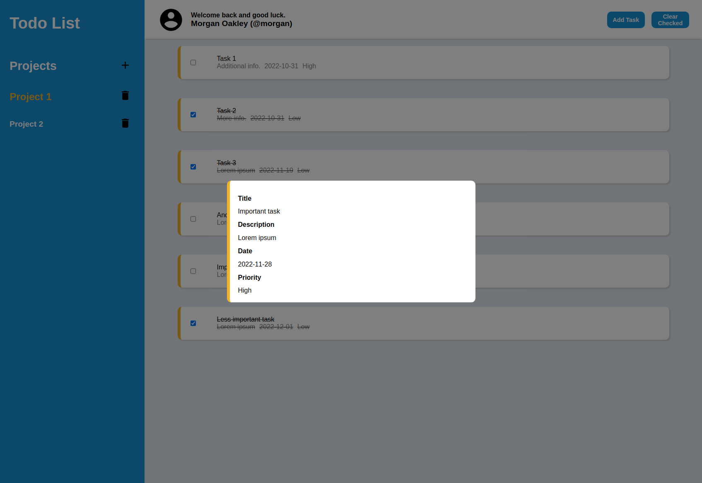

# Odin Project #11: Todo List

The goal of this Odin Project assignment was to create a todo list. The user can create projects and add tasks to them. Each project acts as separate todo list. 

I have recreated this app in React to make code much more readable. I have also added support for routes, improved styling and added Firebase backend for authentication and database features. The new project can be accessed here: https://github.com/brightneon7631/to-do-list-firebase

I started and finished this project in October 2022. Made some changes in June 2023.

## Assignment

[The Odin Project - JavaScript - #11 Todo List](https://www.theodinproject.com/lessons/node-path-javascript-todo-list)

## Technology

- Vanilla JavaScript
- Webpack
- CSS

## Key Concepts

- Webpack config
- ES6 Modules
- Logic separation
- Local storage
- Classes
- Nested arrays / objects

## Features

- Task editing
- Displaying task details
- Removing all completed tasks
- Removing projects
- Saving and retrieving data from local storage

## Links

[Live Demo](https://bn7631-odin-todo-list.pages.dev)

## Screenshots











## Deployment

```bash
# clone repo
git clone https://github.com/BrightNeon7631/odin-todo-list.git

# install project dependencies
npm install

# run webpack dev server
npm start

# create a production build
npm run build

```
